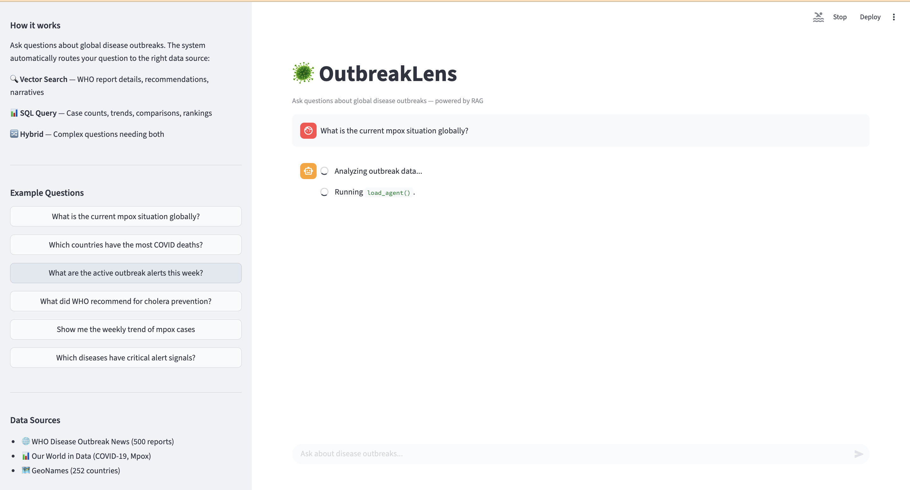

# 🦠 OutbreakLens

**A real-time disease outbreak intelligence platform powered by modern data engineering and Retrieval-Augmented Generation (RAG).**

OutbreakLens ingests global disease outbreak data from multiple public health sources, transforms it through a medallion architecture, generates vector embeddings for semantic search, and exposes it all through an AI-powered chat interface that can answer both qualitative and quantitative questions about disease outbreaks worldwide.

> **Ask it:** *"What is the current mpox situation globally?"* — and it will search WHO reports, query the data warehouse, and generate a comprehensive answer with citations.

---

## 🎯 What This Project Demonstrates

| Skill Area | What I Built |
|---|---|
| **Data Ingestion** | Python scripts pulling from REST APIs (WHO), CSVs (OWID), and file downloads (GeoNames) |
| **Orchestration** | Apache Airflow DAGs with scheduling, retries, and dependency management |
| **Data Lake** | MinIO (S3-compatible) storing raw Parquet files with date-partitioned paths |
| **Data Warehouse** | PostgreSQL with bronze/silver/gold schemas following medallion architecture |
| **Transformations** | dbt models with type casting, joins, aggregations, window functions, and 27 passing tests |
| **Vector Search** | Sentence-transformers embeddings stored in Qdrant for semantic retrieval |
| **RAG Agent** | LLM-powered query router with vector search, SQL generation, and hybrid chains |
| **Frontend** | Streamlit chat UI with source citations, SQL transparency, and conversation history |
| **Infrastructure** | Docker Compose orchestrating 5 services with networking, volumes, and health checks |

---

## 🏗️ System Architecture

```
┌──────────────────────────────────────────────────────────────────────────────┐
│                              DATA SOURCES                                    │
│                                                                              │
│    🌐 WHO Disease              📊 Our World in Data         🗺️ GeoNames     │
│       Outbreak News               (COVID-19, Mpox)            (Country Ref)  │
│       (REST API)                  (CSV / GitHub)              (TSV Download) │
│       500 reports                 ~260K rows                  252 countries  │
└───────┬────────────────────────────┬──────────────────────────┬──────────────┘
        │                            │                          │
        ▼                            ▼                          ▼
┌──────────────────────────────────────────────────────────────────────────────┐
│                     🔄 APACHE AIRFLOW (Orchestration)                        │
│                                                                              │
│    ┌─────────────┐   ┌────────────────┐   ┌──────────────────┐              │
│    │ WHO DON DAG │   │ OWID Ingest DAG│   │ GeoNames Ingest  │              │
│    │  (Daily)    │   │  (Weekly)      │   │  DAG (Monthly)   │              │
│    └──────┬──────┘   └───────┬────────┘   └────────┬─────────┘              │
│           │                  │                     │                         │
│           └──────────┬───────┴─────────────────────┘                         │
│                      ▼                                                       │
│           ┌─────────────────────┐      ┌─────────────────────┐              │
│           │ Bronze → PG Loader  │      │ Embedding Pipeline  │              │
│           │      DAG            │─────▶│      DAG            │              │
│           └─────────┬───────────┘      └──────────┬──────────┘              │
└─────────────────────┼──────────────────────────────┼────────────────────────┘
                      │                              │
        ┌─────────────┼──────────────┐               │
        ▼             ▼              ▼               ▼
┌────────────┐ ┌───────────┐ ┌──────────┐    ┌───────────┐
│   MinIO    │ │PostgreSQL │ │  dbt     │    │  Qdrant   │
│ (Data Lake)│ │(Warehouse)│ │(Transforms)   │(Vector DB)│
│            │ │           │ │          │    │           │
│ bronze/    │ │ bronze.*  │ │ 27 tests │    │ 947 points│
│ ├─who_don/ │ │ silver.*  │ │ passing  │    │ 384-dim   │
│ ├─owid/    │ │ gold.*    │ │          │    │ cosine    │
│ └─geonames/│ │           │ │          │    │           │
└────────────┘ └─────┬─────┘ └──────────┘    └─────┬─────┘
                     │                              │
                     └──────────┬───────────────────┘
                                ▼
                     ┌─────────────────────┐
                     │   🤖 RAG Agent      │
                     │                     │
                     │  ┌───────────────┐  │
                     │  │ Query Router  │  │
                     │  │  (GPT-4o-mini)│  │
                     │  └───┬───┬───┬───┘  │
                     │      │   │   │      │
                     │   ┌──┘   │   └──┐   │
                     │   ▼      ▼      ▼   │
                     │ 🔍      📊     🔀   │
                     │Vector  SQL   Hybrid │
                     │Search  Chain  Chain  │
                     └─────────┬───────────┘
                               │
                               ▼
                     ┌─────────────────────┐
                     │  💬 Streamlit UI    │
                     │  Chat Interface     │
                     │  with Citations     │
                     └─────────────────────┘
```

---

## 🥇 Medallion Architecture

Data flows through three layers, each adding more structure and business value:

```
 ┌──────────────────────────────────────────────────────────────────────┐
 │                                                                      │
 │   🟤 BRONZE            ⚪ SILVER              🟡 GOLD               │
 │   Raw as received      Cleaned & typed        Analytics-ready       │
 │                                                                      │
 │   All TEXT columns     Proper data types      Aggregations          │
 │   No validation        NULL handling          Window functions      │
 │   Date-partitioned     HTML stripped           Trend calculations   │
 │   in MinIO             Joins to dimensions    Alert logic           │
 │                        27 dbt tests                                  │
 │                                                                      │
 │   owid_covid      ──▶  silver_owid_covid  ──▶  gold_active_outbreaks│
 │   owid_mpox       ──▶  silver_owid_mpox   ──▶  gold_disease_trend   │
 │   who_don_reports ──▶  silver_who_don     ──▶  gold_outbreak_timeline│
 │   geonames        ──▶  silver_location_dim──▶  gold_alert_signals   │
 │                        disease_dim (seed)                            │
 │                                                                      │
 └──────────────────────────────────────────────────────────────────────┘
```

### 🟤 Bronze Layer — Raw Ingestion

Raw data exactly as received from external sources. Stored as Parquet in MinIO and loaded into PostgreSQL with all columns as TEXT to avoid type-casting errors.

| Table | Source | Records | Schedule |
|---|---|---|---|
| `bronze.owid_covid` | Our World in Data | ~175K | Weekly |
| `bronze.owid_mpox` | Our World in Data | ~85K | Weekly |
| `bronze.who_don_reports` | WHO REST API | 500 | Daily |
| `bronze.geonames_countries` | GeoNames | 252 | Monthly |

### ⚪ Silver Layer — Cleaned & Normalized

Type-cast, validated, and enriched. HTML stripped from WHO reports, dates parsed, countries joined to the location dimension with ISO codes and WHO regions.

| Model | Key Transformations |
|---|---|
| `silver_location_dim` | ISO codes, WHO region mapping, continent classification, population |
| `silver_owid_covid` | Numeric casting with regex validation, aggregate row filtering, location join |
| `silver_owid_mpox` | Same patterns as COVID, ISO code enrichment from source data |
| `silver_who_don_reports` | HTML tag stripping via regex, URL construction, date part extraction |
| `disease_dim` | Seed table with 15 diseases, transmission types, CFR rates, ICD-11 codes |

### 🟡 Gold Layer — Analytics Models

Business logic applied with aggregations, window functions, and alerting rules.

| Model | What It Does |
|---|---|
| `gold_active_outbreaks` | Active outbreaks (last 90 days) with trend direction using week-over-week smoothed case comparison |
| `gold_disease_trend_weekly` | Weekly aggregated metrics with 4-week rolling averages and WoW growth rates using `LAG()` and `AVG() OVER()` |
| `gold_outbreak_timeline` | Sequenced WHO report timeline with `ROW_NUMBER()`, gap analysis, and monthly volume tracking |
| `gold_alert_signals` | Rule-based alerts: SURGE (>2x rolling avg), RAPID_GROWTH (>50% WoW), HIGH_MORTALITY (>5% CFR) with severity ranking |

---

## 🤖 RAG Agent Architecture

The agent uses an intelligent routing system to answer different types of questions:

```
User Question
      │
      ▼
┌─────────────────┐
│  Query Router   │  GPT-4o-mini classifies the question
│  (GPT-4o-mini)  │  into VECTOR, SQL, or HYBRID
└──┬──────┬───┬───┘
   │      │   │
   ▼      │   ▼
┌──────┐  │  ┌──────────┐
│VECTOR│  │  │  HYBRID  │  Uses BOTH chains
│CHAIN │  │  └──────────┘
│      │  │
│Encode│  ▼
│query │ ┌─────┐
│  ↓   │ │ SQL │
│Search│ │CHAIN│
│Qdrant│ │     │
│  ↓   │ │GPT  │
│Top-5 │ │gen  │
│chunks│ │query│
└──┬───┘ │  ↓  │
   │     │Exec │
   │     │on PG│
   │     └──┬──┘
   │        │
   ▼        ▼
┌─────────────────┐
│Response Generator│  GPT-4o-mini synthesizes context
│  (GPT-4o-mini)   │  into a cited, coherent answer
└──────────────────┘
```

**Example interactions:**

| Question | Route | What Happens |
|---|---|---|
| *"What did WHO recommend for cholera?"* | VECTOR | Embeds question → searches Qdrant → returns relevant WHO report chunks |
| *"Which countries have the most COVID cases?"* | SQL | GPT generates SQL → executes against gold tables → formats results |
| *"What outbreaks have alert signals and what measures are being taken?"* | HYBRID | Runs BOTH chains → combines structured data with narrative context |

---

## 📊 dbt Lineage Graph

The complete data flow from bronze sources to gold analytics models:


---

## 🛠️ Tech Stack

| Component | Technology | Purpose |
|---|---|---|
| **Orchestration** | Apache Airflow 2.10 | Schedule and monitor 5 data pipelines |
| **Data Lake** | MinIO | S3-compatible object storage for raw Parquet files |
| **Data Warehouse** | PostgreSQL 16 | SQL-queryable bronze/silver/gold layer storage |
| **Transformations** | dbt 1.10 | SQL transforms with 27 automated tests and documentation |
| **Vector Database** | Qdrant | 947 embedded WHO report chunks for semantic search |
| **Embeddings** | sentence-transformers | all-MiniLM-L6-v2 model producing 384-dim vectors |
| **LLM** | OpenAI GPT-4o-mini | Query routing, SQL generation, response synthesis |
| **Frontend** | Streamlit | Chat interface with source citations and SQL transparency |
| **Containerization** | Docker Compose | 5 services orchestrated with networking and health checks |
| **Language** | Python 3.11 | All ingestion, embedding, and agent code |

---

## 🚀 Quick Start

### Prerequisites
- Docker Desktop installed and running
- Python 3.10+ with `pip`
- OpenAI API key
- Git

### 1. Clone and Setup

```bash
git clone https://github.com/yourusername/outbreaklens.git
cd outbreaklens

python3 -m venv .venv
source .venv/bin/activate
pip install dbt-postgres==1.9.0 openai sentence-transformers qdrant-client psycopg2-binary streamlit
```

### 2. Configure Environment

```bash
cp .env.example .env
# Edit .env and add your OpenAI API key:
# OPENAI_API_KEY=sk-your-key-here
```

### 3. Start Infrastructure

```bash
docker compose build
docker compose up -d
```

### 4. Verify Services

| Service | URL | Credentials |
|---|---|---|
| Airflow UI | http://localhost:8080 | admin / admin |
| MinIO Console | http://localhost:9001 | outbreaklens / outbreaklens123 |
| Qdrant Dashboard | http://localhost:6333/dashboard | — |

### 5. Run Data Pipelines

Trigger Airflow DAGs in this order via the UI at http://localhost:8080:

1. `bronze_owid_ingestion` — download OWID disease data
2. `bronze_who_don_ingestion` — fetch WHO outbreak reports
3. `bronze_geonames_ingestion` — download country reference data
4. `bronze_load_to_postgres` — load Parquet files into PostgreSQL
5. `embedding_pipeline` — chunk reports and store in Qdrant

### 6. Run dbt Transformations

```bash
cd dbt
dbt seed --profiles-dir .
dbt run --profiles-dir .
dbt test --profiles-dir .
```

### 7. Launch the Chat UI

```bash
cd ~/outbreaklens
export OPENAI_API_KEY="your-key-here"
python -m streamlit run streamlit/app.py
```

Open http://localhost:8501 and start asking questions!

---



## 📁 Project Structure

```
outbreaklens/
│
├── airflow/
│   └── dags/
│       ├── dag_bronze_owid.py            # OWID disease data ingestion
│       ├── dag_bronze_who_don.py         # WHO outbreak reports ingestion
│       ├── dag_bronze_geonames.py        # Country reference data ingestion
│       ├── dag_bronze_to_postgres.py     # MinIO → PostgreSQL loader
│       └── dag_embedding_pipeline.py     # Chunk → embed → Qdrant pipeline
│
├── dbt/
│   ├── models/
│   │   ├── bronze/
│   │   │   └── sources.yml              # Bronze source definitions
│   │   ├── silver/
│   │   │   ├── silver_location_dim.sql   # Country dimension with WHO regions
│   │   │   ├── silver_owid_covid.sql     # Cleaned COVID metrics
│   │   │   ├── silver_owid_mpox.sql      # Cleaned mpox metrics
│   │   │   ├── silver_who_don_reports.sql # Cleaned WHO reports
│   │   │   └── schema.yml               # Silver layer tests
│   │   └── gold/
│   │       ├── gold_active_outbreaks.sql  # Active outbreaks with trends
│   │       ├── gold_disease_trend_weekly.sql # Weekly trends & rolling averages
│   │       ├── gold_outbreak_timeline.sql # WHO report timeline
│   │       ├── gold_alert_signals.sql     # Automated alert detection
│   │       └── schema.yml               # Gold layer tests
│   ├── seeds/
│   │   └── disease_dim.csv              # Disease reference data (15 diseases)
│   ├── macros/
│   │   └── generate_schema_name.sql     # Custom schema naming
│   ├── dbt_project.yml
│   └── profiles.yml
│
├── ingestion/
│   ├── bronze_owid.py                   # OWID CSV downloader with chunked reading
│   ├── bronze_who_don.py                # WHO REST API client with pagination
│   ├── bronze_geonames.py              # GeoNames TSV downloader
│   └── bronze_to_postgres.py           # Parquet → PostgreSQL bulk loader (COPY)
│
├── rag/
│   ├── chunker.py                       # WHO report chunking with overlap
│   ├── embedder.py                      # Embedding generation & Qdrant upsert
│   ├── embedding_pipeline.py            # End-to-end chunk → embed → store
│   ├── agent.py                         # RAG agent with router + 3 chains
│   └── test_agent.py                    # Agent integration tests
│
├── streamlit/
│   └── app.py                           # Chat UI with citations & SQL transparency
│
├── docker-init/
│   └── init-db.sql                      # PostgreSQL schema initialization
│
├── docs/
│   └── lineage-graph.png                # dbt lineage graph screenshot
│
├── docker-compose.yml                   # 5-service infrastructure definition
├── Dockerfile.airflow                   # Custom Airflow image with dependencies
├── requirements-airflow.txt             # Python deps for Airflow containers
├── requirements.txt                     # Python deps for local development
├── .env                                 # Environment variables (not committed)
├── .gitignore
└── README.md
```

---

## 🧪 Data Quality

**27 dbt tests** validate the entire pipeline automatically:

| Test Type | What It Checks | Count |
|---|---|---|
| `unique` | No duplicate IDs in dimension and fact tables | 5 |
| `not_null` | Critical fields (dates, names, IDs) are always populated | 15 |
| `accepted_values` | Disease IDs, continent codes, alert types, severity constrained to valid values | 7 |

---

## 📈 Key Metrics

| Metric | Value |
|---|---|
| Data sources integrated | 3 (WHO, OWID, GeoNames) |
| Bronze tables | 4 |
| Silver models | 4 + 1 seed |
| Gold models | 4 |
| dbt tests passing | 27/27 |
| WHO reports ingested | 500 |
| Vector embeddings stored | 947 |
| Embedding dimensions | 384 |
| Airflow DAGs | 5 |
| Docker services | 5 |

---

## 🧠 Lessons Learned

Building this project surfaced real-world data engineering challenges:

**Dependency Management** — Airflow bundles SQLAlchemy 1.4, but pandas 2.x expects 2.0. Installing your own version breaks Airflow's ORM internals. Solution: use raw psycopg2 for database operations and never override framework-managed dependencies.

**Memory Constraints in Docker** — A 500K-row COVID CSV caused OOM kills when loaded entirely into memory. Solution: chunked CSV reading with filtering during download, and chunked PostgreSQL COPY for bulk loading.

**API Response Inconsistency** — WHO API returns mixed types for the same fields (sometimes a string, sometimes `{"Value": "..."}`, sometimes null). Solution: defensive `safe_get_text()` helpers that handle all cases gracefully.

**Bronze Layer Philosophy** — Storing all columns as TEXT in the bronze layer eliminates type-casting errors during ingestion. Type enforcement belongs in the silver layer where you have full control via dbt's SQL transforms.

**Airflow DAG Import Timeouts** — Importing heavy ML libraries (sentence-transformers, PyTorch) at the top of a DAG file causes 30-second parse timeouts. Solution: lazy imports inside task functions — a critical Airflow best practice.

**Schema Naming in dbt** — dbt's default schema naming concatenates the target schema with the custom schema (e.g., `silver_silver`). Solution: a custom `generate_schema_name` macro that uses only the custom schema name.

---

## 🗺️ Roadmap

- [x] **Phase 1: Data Warehousing** — Bronze/Silver/Gold pipeline with Airflow + dbt
- [x] **Phase 2: Model Building** — Embeddings, Qdrant vector store, RAG agent with GPT
- [x] **Phase 3: Deployment** — Streamlit chat UI with citations and SQL transparency
- [x] Soda Core data quality checks integrated into Airflow
- [x] LangFuse LLM observability and trace logging
- [x] Geospatial visualization with Folium maps

---

## 📄 License

MIT